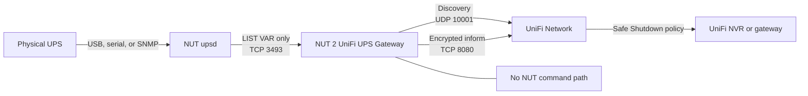

# NUT 2 UniFi UPS Gateway

> [!WARNING]
> This is an independent, experimental compatibility project. It is not made,
> supported, or endorsed by Ubiquiti. Keep your existing NUT shutdown plan and
> never make this gateway the only protection for storage or critical loads.
>
> **A respectful request to Ubiquiti:** please add a neutral `NUTUPS` model that
> enters the existing UniFi UPS flow, or add native NUT support for UniFi NVRs,
> gateways, and other shutdown consumers. Either option would remove the need
> for projects like this one to use a known UniFi UPS identity as a carrier.

Already monitoring a UPS with
[Network UPS Tools](https://networkupstools.org/)? This small, rootless
container reads that UPS and presents its telemetry to UniFi Network as a UPS.
Eligible UniFi consoles can then appear in **Safe Shutdown Pairing**.

The gateway is deliberately one-way: it reads NUT variables but has no NUT
command API. UniFi power-cycle or power-off requests are ignored and can never
switch the upstream UPS. Writable buzzer, automatic AC-recovery cycle, and EPO
capabilities are removed from the gateway's advertised bitmap.

## How it works



NUT remains the source of truth. The container normalizes fresh telemetry,
advertises a controller-recognized UPS carrier, and persists its generated
UniFi identity in one Docker volume.

## Quick start on Synology

You need Container Manager with Docker Compose, a working NUT server, and the
IP address of the UniFi console running Network. Put the Synology and UniFi
console on a trusted management LAN for first adoption.

### 1. Download and verify the v0.9.0 release bundle

For a first install, use an empty project directory and run as a Synology
administrator over SSH. Existing installations should follow the update
procedure in the detailed guide so their site-specific `.env` is not replaced.

```bash
sudo -i
mkdir -p /volume1/docker/nut-2-unifi-ups-gateway
cd /volume1/docker/nut-2-unifi-ups-gateway
release=v0.9.0
bundle="nut-2-unifi-ups-gateway-${release}-synology.tar.gz"
checksums="nut-2-unifi-ups-gateway-${release}-synology.SHA256SUMS"
release_url="https://github.com/d3vi1/nut-2-unifi-ups-gateway/releases/download/${release}"
curl -fL --proto '=https' --tlsv1.2 "$release_url/$bundle" -o "$bundle"
curl -fL --proto '=https' --tlsv1.2 "$release_url/$checksums" -o "$checksums"
sha256sum -c "$checksums"
tar -tzf "$bundle"
```

Continue only when `sha256sum` reports `OK` and the archive listing contains
only `.env`, the two Compose files, and `RELEASE-METADATA.txt` inside one
versioned directory. The generated `.env` pins `N2U_IMAGE` to the exact
multi-platform OCI manifest digest published by this release; do not replace it
with a tag.

Compose intentionally refuses to render when `.env` is missing or
`N2U_IMAGE` is empty. Restore the generated file from the verified release
bundle instead of substituting a mutable image tag.

The checksum detects download or storage corruption. It does not independently
authenticate a compromised release because the bundle and checksum share the
same GitHub Release trust root. Maintainers must make both the repository and
GHCR package public, enable GitHub immutable releases, and protect `v*` tags
before publishing v0.9.0. Those service settings are a mandatory external
release gate.

After those checks succeed, extract the bundle:

```bash
tar -xzf "$bundle" --strip-components=1
chmod 600 .env
```

Edit `.env` and replace `unifi` in `N2U_INFORM_URL` with the real IP address or
resolvable name of your UniFi console. For example, if the console is
`192.0.2.10`, use `http://192.0.2.10:8080/inform`.

### 2. Choose the NUT source

For NUT running on this same Synology, keep the safe defaults:

```dotenv
N2U_NUT_ADDRESS=127.0.0.1:3493
N2U_NUT_UPS=ups
N2U_NUT_ALLOW_INSECURE_REMOTE=false
```

For NUT on another machine, replace `192.0.2.20` and `ups` with the real server
address and UPS name:

```dotenv
N2U_NUT_ADDRESS=192.0.2.20:3493
N2U_NUT_UPS=ups
N2U_NUT_ALLOW_INSECURE_REMOTE=true
```

> [!CAUTION]
> Remote NUT is plaintext because this client does not implement STARTTLS. Set
> `N2U_NUT_ALLOW_INSECURE_REMOTE=true` only across a trusted LAN or VPN. Never
> expose TCP/3493 to the internet, and make sure the NUT ACL permits only the
> gateway host. If the NUT server requires authentication, use the secret-file
> procedure in [the Synology guide](docs/synology.md#authenticated-nut).

The **NUT Server** switch in Network describes a server offered at the emulated
device's own IP; it is not the upstream connection above. It remains off by
default. An advanced, experimental advertisement is available only for a NUT
service that you have independently verified at that exact LAN IP, UPS name,
and port. See [NUT Server advertisement](docs/configuration.md#optional-nut-server-advertisement).

### 3. Validate and start

```bash
docker compose --env-file .env -f compose.yaml config
docker compose --env-file .env -f compose.yaml pull
docker compose --env-file .env -f compose.yaml up -d
docker compose --env-file .env -f compose.yaml ps
curl -fsS http://127.0.0.1:9199/readyz
```

Do not continue until Compose shows the container as healthy and `/readyz`
succeeds. The detailed guide includes authentication, Container Manager notes,
backup, update, and rollback procedures: [Synology deployment](docs/synology.md).

### 4. Adopt and pair in UniFi Network

1. Open **UniFi Network → Devices** and wait for **UPS 2U** to appear. Discovery
   and the first inform can take a minute.
2. Select the UPS and choose **Adopt**. Wait until its state is **Connected**.
3. Open the UPS device panel and expand **Safe Shutdown Pairing**.
4. Pair the eligible UniFi NVR, gateway, or other console, then choose a
   conservative remaining-runtime trigger.
5. Confirm that charge, runtime, line/battery state, and output measurements
   look plausible before planning a supervised outage test.

Pairing shown in the UI is useful evidence, but it does not prove that a real
shutdown will complete. Test that path only during a controlled maintenance
window, with console access and the normal NUT protection still enabled.

## Outlet topology

When the NUT driver publishes outlet information, the gateway projects it
conservatively:

- `outlet.count` sets the number of displayed outlets.
- Equal `outlet.N.groupid` values become one UniFi relay group; an outlet with
  no group ID becomes its own group.
- An unmistakable USB type/designator is shown as USB. Other types use an
  AC-compatible presentation.
- Relay capability appears only when NUT says the outlet, its matched group, or
  the outlet collection is switchable.
- Power-meter capability appears only when NUT publishes direct per-outlet
  current, real-power, or apparent-power data.
- UPS-wide and group-wide totals are never divided into invented per-outlet
  readings.

If NUT exposes no valid outlet topology, the selected carrier supplies a stable
AC-compatible layout only: `USWDA26` presents eight outlets in two groups of
four; `USPDA2C` presents nine singleton groups. That fallback does not invent
relay, metering, automatic-relay, button, or per-outlet state capabilities.
Dynamic topology is **CANDIDATE** behavior until community testing covers more
drivers and Network releases.

## What the UniFi panel means

Some parts of the panel belong to the selected carrier rather than to NUT:

- On `USWDA26`, Network's static catalog labels outlets 1–4 as battery-backed,
  outlets 5–8 as surge-only, and draws two blue **Surge In/Out** RJ45 protection
  jacks. Neither classification is controlled by `outlet_caps`, so the gateway
  cannot truthfully redraw all eight outlets as battery-backed under this
  carrier.
- **Current** is the exact `output.current` value supplied by NUT. If a driver
  reports integer amperes, the gateway cannot recover the lost precision.
- Power utilization uses direct `ups.realpower` and
  `ups.realpower.nominal` values, both in watts. Apparent VA, load percentage,
  and `voltage × current` are not relabeled as real power. Network may display
  its awkward `<100/0 W` fallback when the NUT driver supplies neither watt
  value.
- **Power Cycle on Restore** is not NUT `AUTO_RELAY`. NUT has no exact persistent
  equivalent, so this writable control is not advertised in v0.9.0.
- Exact `enabled` or `disabled` values from `ups.beeper.status` are preserved as
  read-only telemetry when available. The gateway neither advertises nor
  executes the writable **Power-Off Buzzer** capability; Network may still
  render that carrier UI.

## Troubleshooting

| Symptom | What to check |
|---|---|
| `/readyz` fails | Verify `N2U_NUT_ADDRESS`, `N2U_NUT_UPS`, NUT ACLs, and that `upsc UPS@HOST` works from the Synology. |
| Remote NUT is rejected | Use a numeric/reachable host, then opt in with `N2U_NUT_ALLOW_INSECURE_REMOTE=true` only on a trusted LAN or VPN. |
| UPS never appears in Network | Use the console's explicit `/inform` URL, keep UDP/10001 and TCP/8080 reachable, and check `docker logs --since 5m nut-2-unifi-ups-gateway`. |
| Inform stays pending or returns 404 | Confirm `N2U_UNIFI_MODEL=USWDA26`, update Network, and review the build-specific evidence in [Protocol evidence](docs/protocol-evidence.md). |
| Only the 4+4 fallback appears | The NUT driver probably publishes no `outlet.*` variables; this is expected, not fabricated topology evidence. |
| Outlets 5–8 say Surge or blue Surge In/Out jacks appear | This is the static `USWDA26` illustration, not NUT topology or telemetry. |
| Power shows `<100/0 W` or current is a round number | Check `ups.realpower`, `ups.realpower.nominal`, and `output.current` in `upsc`; the gateway does not invent missing precision or convert VA to W. |
| NUT Server is unchecked | Expected by default. Enable the experimental advertisement only after proving a separate NUT service is reachable at the emulated device IP. |
| A UniFi power button does nothing | Expected: controller relay requests are parsed and ignored. This gateway is read-only. |
| A recreated container appears as a new UPS | Restore the original `state` volume. Deleting it intentionally creates a new UniFi identity. |
| Compose says `N2U_IMAGE` must be set | Restore `.env` from the verified release bundle; do not bypass the check with an image tag. |

Useful local checks:

```bash
docker compose --env-file .env -f compose.yaml ps
docker logs --since 5m nut-2-unifi-ups-gateway
curl -fsS http://127.0.0.1:9199/healthz
curl -fsS http://127.0.0.1:9199/metrics
```

Health metrics contain no device identity. Do not post raw controller replies,
packet captures, credentials, MAC addresses, or serial numbers in an issue.

## Container and platforms

The release image is a static Go binary in `scratch`, runs as UID/GID
`65532:65532`, drops every Linux capability, and uses a read-only root
filesystem. GHCR publishes:

- `linux/amd64` (x86_64)
- `linux/arm64` (AArch64)
- `linux/arm/v7` (ARMv7)
- `linux/386` (i386)

The official Synology release bundle supplies an image reference in this form:

```text
ghcr.io/d3vi1/nut-2-unifi-ups-gateway@sha256:<multi-platform-manifest-digest>
```

Human-readable image tags remain available for discovery, but the documented
installation executes the digest-pinned reference generated by the release
workflow.

## Technical documentation

- [Configuration reference](docs/configuration.md)
- [Architecture and the power-write boundary](docs/architecture.md)
- [Protocol evidence and compatibility status](docs/protocol-evidence.md)
- [Synology deployment, authentication, backup, and rollback](docs/synology.md)
- [Security policy](SECURITY.md)
- [Contributing](CONTRIBUTING.md)

Protocol claims use `PROVEN`, `OBSERVED`, `CANDIDATE`, `UNKNOWN`, and
`BLOCKED_EXTERNAL` deliberately. In particular, adoption and pairing have been
observed, while dynamic topologies and a completed shutdown remain separate
acceptance gates.

## Development

The runtime uses only the Go standard library. Run the complete local gate with:

```bash
make check
```

Tagged releases publish a multi-platform image with an SBOM and build
provenance. See [CONTRIBUTING.md](CONTRIBUTING.md) before opening a pull request.

## License

Copyright (C) 2026 d3vi1. Licensed under [GPL-2.0-only](LICENSE).
