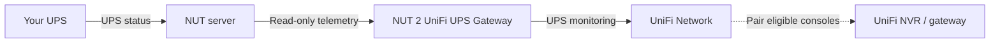

# NUT 2 UniFi UPS Gateway

**Bring your existing NUT-monitored UPS into UniFi Network.**

> [!WARNING]
> Independent, experimental software — not made, supported or endorsed by
> Ubiquiti. Keep your existing NUT shutdown plan. Pairing is not proof of a
> successful shutdown; never use this gateway as your only protection.
>
> **A request to Ubiquiti:** please add a neutral `NUTUPS` model to the UniFi UPS
> flow, or native NUT support for UniFi NVRs and gateways. That would remove the
> need to present another UPS model for compatibility.

Already using [Network UPS Tools (NUT)](https://networkupstools.org/)?
This small Docker gateway reads your UPS status and makes it visible in UniFi
Network. Eligible UniFi consoles can appear in **Safe Shutdown Pairing**.

NUT can run on a Linux server, a NAS or another machine. The gateway does not
need direct USB access to the UPS and never sends it power commands.

## How it fits together



The diagram shows data and pairing, not a proven shutdown path.
**Your existing UPS protection stays in charge.**

## What you need

- A working NUT server and the UPS name it serves, often `ups`.
- A Linux host with Docker Engine and Docker Compose. The gateway can share the
  NUT host or use a remote NUT server.
- A reachable UniFi Network console on a trusted management network.
- One persistent Docker volume for the gateway's identity and saved settings.

Images are built for **x86_64, AArch64, ARMv7 and i386**. The process runs as
a **non-root container user**, with no shell or runtime dependencies.
This does not imply support for a rootless Docker engine or Docker Desktop.
See [tested compatibility and limitations](docs/compatibility.md).

**Synology user?** Follow the same installation below, with the short
[Container Manager notes](docs/synology.md).

## Get started

### 1. Download the deployment files

Open [Releases](https://github.com/d3vi1/nut-2-unifi-ups-gateway/releases) and
download the matching **Compose archive** and **SHA256SUMS** into an empty folder.
If no release is published yet, no stable install bundle is available; `edge`
is for development only.

For the `v0.9.0` bundle:

```sh
sha256sum -c nut-2-unifi-ups-gateway-v0.9.0-compose.SHA256SUMS
tar -tzf nut-2-unifi-ups-gateway-v0.9.0-compose.tar.gz
```

Continue only after checksum `OK` and the expected four files in one versioned
directory; see [download verification](docs/installation.md#download-and-verify).
Then extract into the empty folder:

```sh
tar -xzf nut-2-unifi-ups-gateway-v0.9.0-compose.tar.gz --strip-components=1
chmod 600 .env
```

The included `.env` already selects the exact image. Keep its `N2U_IMAGE` line.

### 2. Connect NUT and UniFi

Edit `.env`. Replace these example addresses and UPS name with your own:

```dotenv
N2U_NUT_ADDRESS=192.0.2.20:3493
N2U_NUT_UPS=ups
N2U_INFORM_URL=http://192.0.2.10:8080/inform
N2U_NUT_ALLOW_INSECURE_REMOTE=true
```

Remote NUT traffic is **unencrypted**: use the last setting only on a trusted
LAN or VPN. For NUT on the same host, use `127.0.0.1:3493` and keep it `false`.
If NUT requires a password, use the [secret-file instructions](docs/installation.md#authenticated-nut).

For the configuration/update behavior observed with Network **10.6.102**, opt in
to the following **only after accepting the trusted-LAN limitations** in
[the installation guide](docs/installation.md#unifi-compatibility-options):

```dotenv
N2U_UNIFI_HTTP_GCM_VOLATILE_CFGVERSION_SYNC=false
N2U_UNIFI_HTTP_GCM_CONFIG_RECEIPT_MODE=persistent
N2U_UNIFI_HTTP_GCM_REPORTED_FIRMWARE_SYNC=true
```

These remember Network's configuration marker and requested firmware version.
They do not apply power settings or install Ubiquiti firmware. Defaults remain off.

### 3. Start, adopt and check

If using a password, add `-f compose.auth.yaml` to every Compose command below.

```sh
docker compose --env-file .env -f compose.yaml config --quiet
docker compose --env-file .env -f compose.yaml pull
docker compose --env-file .env -f compose.yaml up -d
docker compose --env-file .env -f compose.yaml ps
curl -fsS http://127.0.0.1:9199/readyz
```

In **UniFi Network → Devices**, find **UPS 2U**, choose **Adopt**, and wait for it
to come online. Open its panel to check battery/runtime readings and pair eligible
consoles in **Safe Shutdown Pairing**. Allow about a minute for discovery.

Healthy means the process is running; `/readyz` checks fresh NUT telemetry.
Neither proves adoption, pairing or a completed shutdown.
[Before any outage test](docs/compatibility.md#operator-controlled-checks).

## Good to know

- **Some outlets look wrong:** Network draws parts of the selected UniFi model
  from its own catalog. Surge jacks and battery icons may not match your real UPS.
- **Power buttons do nothing:** intentional. No outlet, buzzer, reboot or UPS
  power operation is executed by this gateway.
- **NUT Server is unchecked:** this is not your upstream connection. The gateway
  does not run a NUT server. [Advanced advertisement](docs/configuration.md#optional-nut-server-advertisement).
- **Two different versions:** Network shows compatibility firmware text.
  The real gateway release is shown by
  `docker compose exec -T gateway /nut-2-unifi-ups-gateway version`.
- **Keep the state volume:** it contains the adopted identity. Preserve it when
  [updating, backing up or rolling back](docs/installation.md#update).
- **Something failed?** Start with [troubleshooting](docs/troubleshooting.md);
  do not post raw NUT dumps, state files or controller replies.

## Learn more and contribute

[Install / update](docs/installation.md) · [Synology](docs/synology.md) ·
[Compatibility](docs/compatibility.md) · [Configuration](docs/configuration.md) ·
[Security](SECURITY.md) · [Contributing](CONTRIBUTING.md)

Developer details: [architecture](docs/architecture.md),
[protocol evidence](docs/protocol-evidence.md), [release maintenance](docs/releasing.md).

## License

Copyright (C) 2026 d3vi1. [GPL-2.0-only](LICENSE).
