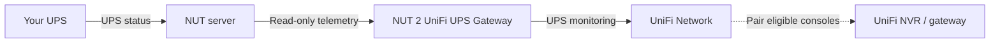

# NUT 2 UniFi UPS Gateway

**Bring your existing NUT-monitored UPS into UniFi Network.**

> [!WARNING]
> Independent, experimental software — not made, supported or endorsed by
> Ubiquiti. Keep your existing NUT shutdown plan. Pairing is not proof of a
> successful shutdown; never use this gateway as your only protection.
>
> **A request to Ubiquiti:** please add a neutral virtual ("fake") UPS model,
> such as `NUTUPS`, to the UniFi Network UPS flow. Let its socket topology and
> features come from the `outlet_table` and capabilities reported in `INFORM`,
> without imposing sockets, relay groups, battery-backed zones or controls from
> a fixed hardware template. Missing capabilities should stay unavailable, not
> be assumed. Alternatively, please add native NUT support for UniFi NVRs and
> gateways. Either would remove the need to impersonate a physical UniFi UPS.

Already using [Network UPS Tools (NUT)](https://networkupstools.org/)?
This small Go gateway reads your UPS status and makes it visible in UniFi
Network. Eligible UniFi consoles can appear in **Safe Shutdown Pairing**.

NUT can run on a Linux server, a NAS or another machine. The gateway does not
need direct USB access to the UPS and never sends it power commands.

## How it fits together



The diagram shows data and pairing, not a proven shutdown path.
**Your existing UPS protection stays in charge.**

## Choose how to run it

| Your Linux device | Mode | Network identity |
|---|---|---|
| A dedicated UPS appliance | `shared` native daemon | The appliance's real IP and interface MAC |
| A NAS/server that also does other work | `separate` container | A dedicated LAN IP and MAC; the NAS keeps its own identity |

Both modes verify the actual local interface and preserve adoption state. Neither
mode invents a MAC or changes host networking. Do not use `shared` to disguise a
NAS as a UPS while expecting it to remain an independent Network client.
For the daemon, start with [Shared mode](docs/runtime-modes.md#shared-native-daemon).
The container instructions follow below.

**Want the UPS to get its address from DHCP/UniFi?** The new
[managed-addressing candidate](docs/managed-network.md) adds DHCP or static
configuration inside a separate network-helper container. The UPS process stays
non-root; the helper needs limited network privileges. DHCP migration and full
container recreation were observed on one Synology deployment, with Online state
and pairings confirmed by its operator. Other hosts still need validation; the
quick-start below describes the separate Docker-managed static alternative.

## What you need for the container

- A working NUT server and the UPS name it serves, often `ups`.
- A Linux host with rootful Docker Engine and Docker Compose. The normal template
  requires **2.23.2 or later**; [older Synology setups](docs/synology.md) have an
  alternate template for Compose 2.20.x with Engine 24.
- A pre-created macvlan network, a free LAN IPv4 address reserved for this
  gateway, and a stable unique MAC address. The NAS keeps its own IP and MAC.
- A reachable UniFi Network console on a trusted management network.
- One persistent Docker volume for the gateway's identity and saved settings.

Images are built for **x86_64, AArch64, ARMv7 and i386**. The process runs as
a **non-root container user**, with no shell or runtime dependencies.
This does not imply support for a rootless Docker engine or Docker Desktop.
See [tested compatibility and limitations](docs/compatibility.md).

**Synology user?** Follow the same installation below, with the short
[Container Manager notes](docs/synology.md).

## Get started

### 1. Download the deployment files

This source tree documents the **0.9.1 dedicated-network deployment**. It does
not establish release publication or compatibility with your host.
The immutable `v0.9.0` bundle uses its own versioned instructions; do not mix it
with these templates. Existing users: read the
[migration procedure](docs/installation.md#migrate-from-host-networking) first.

Open [Releases](https://github.com/d3vi1/nut-2-unifi-ups-gateway/releases) and
download the matching **Compose archive** and **SHA256SUMS** into an empty folder.
Wait for the matching release if it is absent; `edge` is for development only.

Once the `v0.9.1` bundle is published:

```sh
sha256sum -c nut-2-unifi-ups-gateway-v0.9.1-compose.SHA256SUMS
tar -tzf nut-2-unifi-ups-gateway-v0.9.1-compose.tar.gz
```

Continue only after checksum `OK` and the expected eight files in one versioned
directory; see [download verification](docs/installation.md#download-and-verify).
Then extract into the empty folder:

```sh
tar -xzf nut-2-unifi-ups-gateway-v0.9.1-compose.tar.gz --strip-components=1
chmod 600 .env
```

The included `.env` already selects the exact image. Keep its `N2U_IMAGE` line.

### 2. Connect NUT and UniFi

Have the administrator [prepare the LAN network](docs/installation.md#prepare-the-dedicated-lan-network).
Edit `.env`. Replace every synthetic example below, including the MAC, with your
own reserved values. For an existing adoption, retain its UPS MAC from Network:

```dotenv
N2U_LAN_NETWORK=n2u-lan
N2U_DEVICE_IP=192.0.2.30
N2U_DEVICE_MAC=02:00:00:00:00:30
N2U_NUT_ADDRESS=192.0.2.20:3493
N2U_NUT_UPS=ups
N2U_INFORM_URL=http://192.0.2.10:8080/inform
N2U_NUT_ALLOW_INSECURE_REMOTE=true
N2U_UNIFI_NUT_SERVER_ENABLED=false
```

Remote NUT traffic is **unencrypted**: enable `N2U_NUT_ALLOW_INSECURE_REMOTE` only on a trusted
LAN or VPN. The container does not request DHCP: Docker assigns the configured
static IP, which must be excluded from the DHCP pool or otherwise reserved
against allocation. For NUT on the same NAS/Linux host, use the
[optional internal bridge](docs/installation.md#nut-on-the-same-host), its gateway
address and the same explicit plaintext opt-in.
If NUT requires a password, use the [secret-file instructions](docs/installation.md#authenticated-nut).

For the configuration/update behavior observed with Network **10.6.102**, opt in
to the following **only after accepting the trusted-LAN limitations** in
[the installation guide](docs/installation.md#unifi-compatibility-options):

```dotenv
N2U_UNIFI_HTTP_GCM_VOLATILE_CFGVERSION_SYNC=false
N2U_UNIFI_HTTP_GCM_CONFIG_RECEIPT_MODE=persistent
N2U_UNIFI_HTTP_GCM_REPORTED_FIRMWARE_SYNC=true
```

These remember Network's configuration marker and requested firmware version.
They do not apply power settings or install Ubiquiti firmware. Defaults remain off.

### 3. Start, adopt and check

If using a password, add `-f compose.auth.yaml` to every Compose command below.
For same-host NUT, also add `-f compose.nut-host.yaml`.
On the older Compose/Engine combination, replace `-f compose.yaml` with
`-f compose.legacy.yaml` in every command; never combine the two base files.
For same-host NUT on Engine 24 / Compose 2.20.x, read the
[two-network limitation](docs/synology.md#choose-the-compatible-template) first.

```sh
docker compose --env-file .env -f compose.yaml config --quiet
docker compose --env-file .env -f compose.yaml pull
docker compose --env-file .env -f compose.yaml up -d
docker compose --env-file .env -f compose.yaml ps
docker compose --env-file .env -f compose.yaml exec -T gateway /nut-2-unifi-ups-gateway healthcheck
```

In **UniFi Network → Devices**, find **UPS 2U**, choose **Adopt**, and wait for it
to come online. Open its panel to check battery/runtime readings and pair eligible
consoles in **Safe Shutdown Pairing**. Allow about a minute for discovery.

The healthcheck runs inside the container and checks the process; its private
`/readyz` endpoint checks fresh NUT telemetry.
Neither proves adoption, pairing or a completed shutdown.
[Before any outage test](docs/compatibility.md#operator-controlled-checks).

## Good to know

- **Some outlets look wrong:** Network draws parts of the selected UniFi model
  from its own catalog. Surge jacks and battery icons may not match your real UPS.
- **Power buttons do nothing:** intentional. No outlet, buzzer, reboot or UPS
  power operation is executed by this gateway.
- **NUT Server stays unchecked:** the gateway is a NUT client. Neither the LAN
  interface nor the same-host overlay creates a NUT server or proxy.
- **Two different versions:** Network shows compatibility firmware text.
  The real gateway release is shown by
  `docker compose exec -T gateway /nut-2-unifi-ups-gateway version`.
- **Keep the state volume:** it contains the adopted identity. Preserve it when
  [updating, backing up or rolling back](docs/installation.md#update). A changed
  IP still needs Network and pairing validation; saved state alone cannot promise it.
- **Something failed?** Start with [troubleshooting](docs/troubleshooting.md);
  do not post raw NUT dumps, state files or controller replies.

## Learn more and contribute

[Install / update](docs/installation.md) · [Synology](docs/synology.md) ·
[Compatibility](docs/compatibility.md) · [Configuration](docs/configuration.md) ·
[Security](SECURITY.md) · [Contributing](CONTRIBUTING.md)

Developer details: [architecture](docs/architecture.md),
[protocol evidence](docs/protocol-evidence.md), [release maintenance](docs/releasing.md).

## License

Copyright (C) 2026 d3vi1. [GPL-2.0-only](LICENSE).
